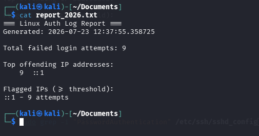
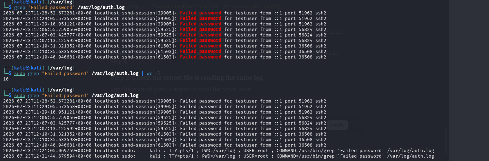

# Linux Log Analyzer & Brute-Force Detector

A beginner cybersecurity project that parses Linux SSH authentication logs to detect brute-force login attempts. Built and tested on Kali Linux.

## Why I Built This

I wanted to actually understand how brute-force detection works instead of just installing `fail2ban` and trusting it blindly. So I built a smaller version myself. Reading raw log lines, writing the parsing logic, and fixing real bugs taught me a lot more than a tutorial would have.

## What It Does

The script scans `/var/log/auth.log` for failed SSH login attempts. It counts how many times each address fails, flags anything that crosses a threshold, and writes a timestamped report.

Basically a tiny, simplified version of what real SOC tooling does: parse logs, spot patterns, flag suspicious activity, report it.

## How It Works

1. Reads every line in the authentication log
2. Uses a regular expression to find lines containing `Failed password` and extract the source address
3. Counts failed attempts per address
4. Flags any address whose count meets or exceeds a threshold (default: 5)
5. Writes all of this to a timestamped `report_YYYYMMDD_HHMMSS.txt` file

```python
ip_pattern = re.compile(r"Failed password.*from ([0-9a-fA-F:.]+) port")
```

## Environment

- **OS:** Kali Linux (VM)
- **Language:** Python 3
- **Log source:** `/var/log/auth.log` (rsyslog)
- **Test setup:** a dedicated low-privilege `testuser` account, used to generate realistic failed-login attempts via `ssh testuser@localhost` rather than testing against root

## Sample Output

Real report generated from an actual test run against my own machine:



```
=== Linux Auth Log Report ===
Generated: 2026-07-23 12:37:55.358725

Total failed login attempts: 9

Top offending IP addresses:
    9  ::1

Flagged IPs (>= threshold):
::1 - 9 attempts
```

Corresponding raw log evidence from `/var/log/auth.log`:



```
sshd-session[59525]: Failed password for testuser from ::1 port 56824 ssh2
sshd-session[59525]: Failed password for testuser from ::1 port 56824 ssh2
sshd-session[59525]: Failed password for testuser from ::1 port 56824 ssh2
sshd-session[59525]: Connection closed by authenticating user testuser ::1 port 56824 [preauth]
sshd-session[59525]: PAM 2 more authentication failures; ... user=testuser
```

## Installation & Usage

```bash
# Clone the repo
git clone https://github.com/TevinKaranja/LINUX-LOG-ANALYZER-AND-BRUTE-FORCE-DETECTOR.git
cd LINUX-LOG-ANALYZER-AND-BRUTE-FORCE-DETECTOR

# Make the script executable
chmod +x log_analyzer.py

# Run it (root privileges are needed to read /var/log/auth.log)
sudo ./log_analyzer.py

# View the generated report
cat "$(ls -t report_*.txt | head -1)"
```

To simulate an attack for testing, open a second terminal and repeatedly attempt an SSH login with a wrong password against a test account:

```bash
ssh testuser@localhost
# enter a wrong password a few times
```

## Technologies Used

- **Python 3** — log parsing, regex matching, report generation
- **Bash** — a simpler equivalent version using `grep`, `awk`, `sort`, and `uniq` is also included (`log_analyzer.sh`)
- **Linux authentication logging** — `rsyslog`, `/var/log/auth.log`, `sshd`
- **Kali Linux** — testing environment

## Lessons Learned / Challenges Faced

Here's the bug that actually taught me something. My first regex only matched IPv4 addresses:

```python
ip_pattern = re.compile(r"Failed password.*from (\d+\.\d+\.\d+\.\d+)")
```

I ran the script and got 0 failed attempts. But `grep "Failed password" /var/log/auth.log | wc -l` showed 10 matches on the exact same file. So the log had the data, but my script wasn't seeing it.

Took me a while to catch it: I was testing with `ssh testuser@localhost`, which connects over `::1`, the IPv6 loopback address. Not IPv4. My regex had no way to match that, so every single line quietly failed to parse, with no error, no warning, just an empty counter.

Fixed it by loosening the pattern to accept both formats:

```python
ip_pattern = re.compile(r"Failed password.*from ([0-9a-fA-F:.]+) port")
```

Ran it again, got the correct count. Lesson: don't trust that a script is broken (or working) just by looking at its output. Compare it against the raw data with something simple like `grep` first.

## Future Improvements

- [ ] Simulate a more realistic attack using `hydra` (included in Kali) against a local test SSH service
- [ ] Automate scans on a schedule using `cron`
- [ ] Auto-block flagged IP addresses, or integrate with `fail2ban`
- [ ] Generate an HTML report instead of plain text, for a dashboard-style view
- [ ] Add GeoIP lookups to show the origin country of offending addresses
- [ ] Add email/Slack alerting when an address crosses the threshold

## Disclaimer

Everything here was tested only against my own machine and accounts. Any brute-force testing (manual or with tools like `hydra`) was run against `localhost` in my own lab setup only. Don't point login-attack tools at anything you don't own or don't have explicit permission to test.
